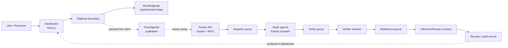

# EdgeNet.AI Architecture

## System Purpose

EdgeNet.AI is a systems prototype for decentralized AI inference. The repository explores how a client-facing dashboard, a routing layer, execution agents, a verifier, and a receipt contract could fit together in a verifiable edge-compute workflow.

The important architectural point is separation of concerns:

- the dashboard visualizes and submits work
- the router is responsible for admission and dispatch
- node agents execute tasks
- the verifier evaluates outputs
- contracts record receipts

The current repository implements this architecture unevenly on purpose. The dashboard is demo-ready. The service layer is partially implemented. The architecture itself is ahead of full integration.

## Component Diagram

## Module Responsibilities

| Module | Responsibility | Current state |
| --- | --- | --- |
| `apps/dashboard` | UI for tasks, nodes, receipts, KPIs, and system narrative | Most complete part of the repo |
| `EdgeApi` abstraction | Isolates UI from data source details | Implemented |
| `MockEdgeApi` | Supplies seeded demo data and scenarios | Mock-backed |
| `TrpcEdgeApi` | Intended live client path from dashboard to backend | Scaffolded |
| `apps/router-api` | Accept tasks, persist them, enqueue downstream work | Partial |
| `apps/verifier` | Verify execution results and initiate settlement | Partial |
| `apps/node-agent` | Execute inference workloads | Partial |
| `packages/contracts` | Emit and store receipts on-chain | Implemented |
| `packages/proto` / `packages/sdk` | Shared schemas and contract-facing utilities | Implemented |

## Data Flow: Task Submission To Receipt

### 1. Submit

A user creates a task with a type such as `LLM_SUMMARY` or `OCR_IMAGE` and chooses an SLA tier.

### 2. Dispatch

The intended router layer decides how many nodes should participate based on the SLA tier and enqueues the task for execution.

### 3. Execute

Node agents process the task and return outputs, hashes, latency, and telemetry.

### 4. Verify

The verifier compares outputs across redundant executions and classifies the result. In the current codebase, this is modeled around pass/fail/dispute-style outcomes.

### 5. Settle

For successful outcomes, the settlement step can emit a receipt via the contract layer and mirror it into local state.

### 6. Receipt

The receipt becomes the audit-oriented artifact that the dashboard can display back to the user.

## Interface Boundaries

### Dashboard boundary

The most important boundary in the current repository is the `EdgeApi` interface used by the dashboard:

- it allows the UI to remain stable while the backend evolves
- it keeps mock mode and live mode conceptually separate
- it makes the dashboard useful even when the full service graph is not ready

This is why the mock-backed UI still feels architecturally credible: it is not hardcoded directly to fake data everywhere. It depends on an explicit interface.

### Service boundaries

The backend-facing boundaries are also visible even if they are not fully exercised in the default demo:

- router API for intake and orchestration
- queue boundaries between dispatch, verification, and settlement
- node-agent API for execution
- contract boundary for receipt emission

## Mock Mode vs Future Live Mode

### Mock mode today

The current dashboard presentation path is:

`Dashboard -> EdgeApi -> MockEdgeApi`

This path is deliberate. It provides a stable showcase experience and allows the UI to visualize tasks, nodes, receipts, and network scenarios without depending on a fragile in-progress backend.

### Future live mode

The intended future path is:

`Dashboard -> EdgeApi -> TrpcEdgeApi -> Router API -> queues/workers/agents/contracts`

The client scaffold for this exists, but it is not ready for reliable showcase use. In the current build, selecting `trpc` is intentionally guarded so the demo remains stable.

## Why The Dashboard Uses `EdgeApi`

The `EdgeApi` abstraction is the clearest architectural choice in the repository because it solves a real prototype problem:

- reviewers need to see the system behavior before the backend is fully integrated
- the UI should not be rewritten later just because the data source changes
- mock scenarios are valuable for teaching and demonstration

In other words, the abstraction is not only a frontend convenience. It is the mechanism that lets the repository function as a credible systems prototype today.

## Implemented vs Planned

### Implemented now

- static-exportable dashboard
- mock-backed task, node, receipt, and metric views
- scenario-based demo data
- typed dashboard interface boundary
- receipt contract with tests

### Partially implemented

- router API and task routes
- verifier workers
- node-agent execution paths
- contract SDK integration

### Planned or not yet demo-ready

- live dashboard client mode
- repeatable full-stack local happy path from UI through receipt emission
- production-grade OCR execution
- deployed network operations

